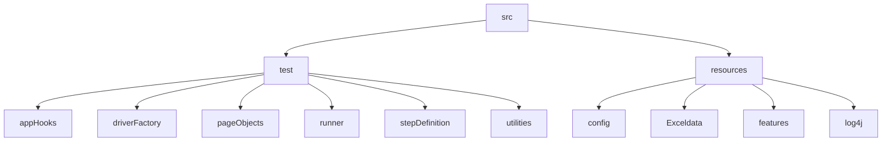

# DsAlgo Project

## Table of contents
* [General info](#general-info)
* [Tools and Technologies](#tools-and-technologies)
* [FrameWork](#framework)
* [Setup](#setup)


## General info
* Introduction

## Tools and Technologies
Project is created with:
* Java v11
* Selenium-Java v4.5.0
* cucumber-testng v7.9.0
* log4j v2.19.0
* allure-testng v2.20.1
* webdrivermanager v5.3.1

## Setup
To run this project, 

```
$ cd ..
```

## FrameWork

