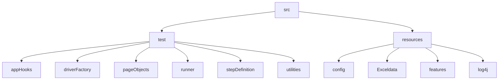

# DsAlgo Project

## Table of contents
* [General info](#general-info)
* [Tools and Technologies](#tools-and-technologies)
* [FrameWork](#framework)
* [Running Project](#running-project)
* [Reporting](#reporting)


## General info
* Introduction : Numpy Ninja’s “Data Structures and Algorithms(Ds Algo)” Project is learning tool It provides an excellent guide to implement algorithms from scratch like Arrays, Linked lists, Stack, Queue, Tree, Graph algorithms in Python

## Tools and Technologies
Project is created with:
* Maven - Dependency management
* Java
* Selenium Webdriver
* Cucumber with TestNG - BDD approach
* log4j - Logging
* Allure-testng - Reporting

## Framework

## Running Project
To run this project, 
Open terminal (MAC OS) or command prompt / power shell (for windows OS) and navigate to the project directory type mvn clean test command to run features
```
$ cd <Project Directory>

$ mvn clean test
```
Features will run in order :
1. Home.feature
2. Register.feature
3. Signin.feature
4. Array.feature
5. LinkedList.feature
6. Stack.feature
7. Queue.feature
8. Tree.feature
9. Graph.feature

Running with tags
```
$ cd <Project Directory>

$ mvn test -Dcucumber.filter.tags="@tree"
```
## Reporting

Once tests complete run reports are generated. This framework uses different types of test reporters to communicate pass/failure.

Allure Report: 

Report will be generated into temp folder. Web server with results will start appearing in your default browser. 

```
$ cd <Project Directory>

$ allure serve allure-results
```
HTML Report: 

Report will be generated tо directory: target/dsAlgoReport.html


### Develop automation scripts using BDD approach - Cucumber-Java :

Tests are written in the Cucumber framework using the Gherkin Syntax. More about Gherkin & Cucumber can be found at https://cucumber.io/docs/cucumber/ 

### The Page Object Design Pattern (Selenium PageFactory) :

The Page Object Pattern technique provides a solution for working with multiple web pages and prevents unwanted code duplication and enables an uncomplicated solution for code maintenance. In general, every page application is represented by a unique class of its own and the page element inspection will be implemented in every class. When A test fails due to selector that is no longer valid/have changed, and that selector may be used by many other steps. By having all selectors at single place, fixing one selector on the page object could repair a number of failing tests that were affected by the same selector.

In this framwork we have used Selenium PageFactory : Page Factory is an inbuilt Page Object Model concept for Selenium WebDriver and it is very optimized. 
