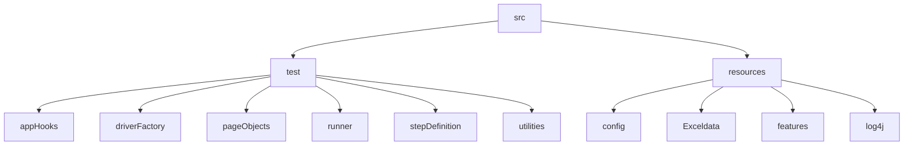

# DsAlgo Project

## Table of contents
* [General info](#general-info)
* [Tools and Technologies](#tools-and-technologies)
* [FrameWork](#framework)
* [Reporting](#reporting)


## General info
* Introduction : Numpy Ninja’s “Data Structures and Algorithms(Ds Algo)” Project is learning tool It provides an excellent guide to implement algorithms from scratch like Arrays, Linked lists, Stack, Queue, Tree, Graph algorithms in Python

## Tools and Technologies
Project is created with:
* Maven - Dependency management
* Java
* Selenium Webdriver
* Cucumber with TestNG - BDD approach
* log4j - Logging
* Allure-testng - Reporting

## FrameWork

## Reporting
To run this project, 

```
$ cd ..
```
